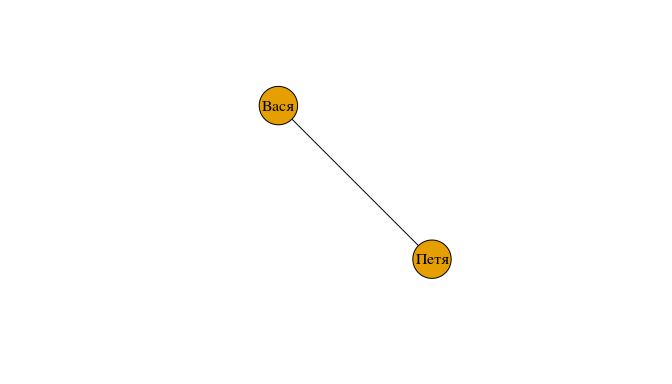
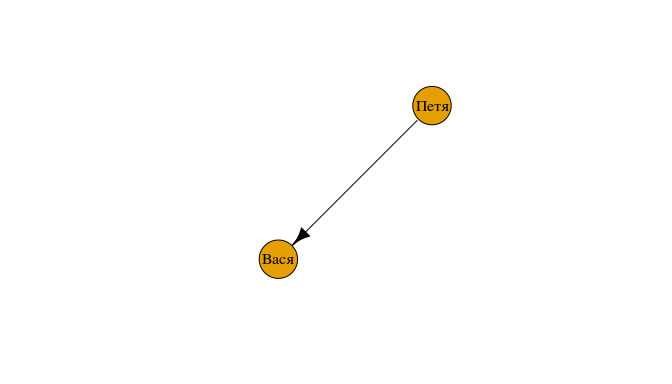

Домашнее задание 1
================
Алла Тамбовцева

Формат сдачи
------------

*Срок сдачи:*

22 сентября 2017, 22:00

*Формат сдачи:*

Студенту необходимо выполнить задание из части 1, а также на выбор выполнить задачи базового или продвинутого блока из части 2. Результат выполнения домашнего задания 1: файл с расширением `.Rmd`(часть 1) и файл с расширением `.R`(часть 2). Эти два файла нужно загрузить по [ссылке](https://www.dropbox.com/request/KsPCDUxWzG2F6TOzQo4R). Ссылку на RPubs для первой части задания нужно вписать в [таблицу](https://docs.google.com/spreadsheets/d/1F9T1AWDOdRO43VNlKM7yq1oj5hbIaq-VMqPyHyf3oAE/edit?usp=sharing).

Часть 1
-------

*Эта часть задания является обязательной для всех, вне зависимости от того, задачи какого блока (базового или продвинутого) Вы будете выполнять далее.*

**Задание**

1.  Создать файл `hw1-rmd-surname.Rmd`, где surname -- Ваша фамилия латиницей.
2.  Воспроизвести файл, опубликованный по [ссылке](http://rpubs.com/AllaT/rmd-replic): набрать в созданном файле `hw1-rmd-surname.Rmd` текст с соответствующей разметкой, добавить необходимый код (см.ниже) и график.
3.  Сохранить изменения в Rmd-файле, "связать" html-файл и опубликовать его на RPubs. Ссылку на RPubs вписать в эту [таблицу](https://docs.google.com/spreadsheets/d/1F9T1AWDOdRO43VNlKM7yq1oj5hbIaq-VMqPyHyf3oAE/edit?usp=sharing). Опубликованный файл должен выглядеть так же, как и файл, предложенный для репликации.

Код для графика:

``` r
freqs <- c(7, 2, 2) # частоты
lvls <- c("Начальный", "Средний", "Продвинутый") # уровни
colors <- c("royalblue", "yellow", "red") # цвета для диаграммы
percs <- round(freqs / sum(freqs) * 100) # относительные частоты (в процентах)
labels <- paste(lvls, percs) # склеить уровни и проценты - для подписей к диаграмме
labels_fin <- paste(labels,"%", sep = "") # добавить знак % к подписям
pie(freqs, labels = labels_fin, col = colors, main = "Уровень владения R") 
```

Часть 2
-------

### Базовый блок

Скачайте с GitHub файл `hw1-rcode.R`, переименуйте его `hw1-rcode-surname.R`, где `surname` -- Ваша фамилия латиницей. Откройте этот файл в R -- в него Вы будете вписывать код для задач.

**Задача 1**

Посчитайте в R:

-   *l**o**g*<sub>10</sub>(1000) + *l**o**g*<sub>3</sub>(27)
-   2<sup>7</sup> ⋅ 3<sup>2</sup> ⋅ *e*<sup>2</sup>
-   sin(*π*<sup>2</sup>)

**Задача 2**

Два события *A* и *B* являются независимыми, если выполняется условие *P*(*A* ∩ *B*)=*P*(*A*)⋅*P*(*B*). Вероятности событий заданы следующим образом:

``` r
pA <- 0.8 # A
pB <- 0.7 # B
pAB <- 0.6 # пересечение A и B
```

Проверьте с помощью R, являются ли события *A* и *B* независимыми.

*Ваш код должен работать для любых pA, pB и pAB, т.е. если мы присвоим этим переменным другие значения, код будет корректно проверять независимость событий *A* и *B**.

**Задача 3**

Известно, что дискретная случайная величина *X* принимает значения 0, 1, 2, 8 с соответствующими вероятностями: 0.5, 0.3, 0.1, 0.1. Сохраните значения случайной величины в вектор `x`, а вероятности -- в вектор `p`. Найдите математическое ожидание и дисперсию случайной величины *X*.

*Напоминание.* Математическое ожидание -- ожидаемое среднее значение случайной величины -- вычисляется следующим образом:
E(X) =\sum\limits_{i=1}^{n}x_ip_i.

Другими словами, перемножаем значения и соответствующие им вероятности, а потом все суммируем).

Дисперсия -- показатель разброса значений случайной величины относительно ожидаемого среднего значения -- вычисляется следующим образом:
*D*(*X*)=*E*(*X*<sup>2</sup>)−\[*E*(*X*)\]<sup>2</sup>.

*Подсказка.* Для вычислений помимо обычных арифметических операций понадобится функция `sum()`. Узнать, как эта функция работает, можно через `?sum()`.

**Задача 4**

Дан вектор `group`:

``` r
group <- c("group_1", "group_2", "group_3", "group_4")
```

Используя вектор `group`, создайте вектор `gr`:

    ## [1] "group1" "group2" "group3" "group4"

Используя вектор `gr`, создайте вектор `G`:

    ## [1] "GR1" "GR2" "GR3" "GR4"

**Задача 5**

Число действительных бюллетеней на избирательных участках некоторой территориальной избирательной комиссии задается вектором `valid_v`, а число недействительных бюллетеней -- вектором `invalid_v`. Общее число зарегистрированных избирателей задается вектором `reg_voters`.

``` r
valid_v <- c(20, 8, 12, 18, 25, 32, 10, 17, 22, 17)
invalid_v <- c(1, 0, 4, 3, 9, 2, 0, 5, 1, 0)
reg_voters <- c(50, 75, 62, 54, 98, 55, 72, 80, 44, 48)
```

Создайте вектор `turnout`, который содержит значения явки (в процентах) на избирательных участках.

*Напоминание.* Явка определяется как доля суммы действительных и недействительных бюллетеней от общего числа зарегистрированных избирателей.

Создайте вектор `turnout_round`, который содержит значения явки (в процентах), округленные до второго знака после запятой.

**Задача 6**

Вектор `ages` представляет собой набор значений возраста респондентов женского пола, принимавших участие в опросе.

``` r
ages <- c(23, 18, 19, 33, 36, 27, 67, 62, 78, 45, 42, 38, 55, 16, 14, 17, 91)
```

Выберите из вектора `ages` значения, которые соответствуют трудоспособному возрасту (в России для женщин -- с 16 до 54 лет), и сохраните их в вектор `work_age`. Сколько людей такого возраста среди наших респондентов?

Выберите из вектора `ages` значения, которые соответствуют возрасту, младше трудоспособного (в России -- менее 16 лет), и сохраните их в вектор `young_age`. Сколько людей такого возраста среди наших респондентов?

**Задача 7**

Дан вектор `polit`, который содержит ответы 10 студентов на вопрос "На сколько процентов Вы считаете себя политологом?"

``` r
polit <- c(25, 56, 87, 70, 18, 99.5, 48, 65, 12, 30)
```

Замените все элементы вектора `polit`, которые превышают 60, на 1, а остальные элементы замените на 0. Преобразуйте вектор `polit` таким образом, чтобы при вызове функции `str()` был выдан следующий результат:

``` r
str(polit)
```

    ##  Factor w/ 2 levels "0","1": 1 1 2 2 1 2 1 2 1 1

**Задача 8**

В R много интересных названий цветов. Вектор `COLS` -- набор названий некоторых из них.

``` r
COLS <- c("gray77", "antiquewhite", "ghostwhite", 
          "springgreen", "powderblue", "mediumvioletred", 
          "mediumaquamarine", "hotpink", "firebrick")
```

Отсортируйте вектор `COLS` по алфавиту и сохраните результат в вектор `COLS_SORT`.

Какой индекс в `COLS_SORT` имеет цвет "hotpink"?

Какой индекс в исходном векторе `COLS` имеет цвет "springgreen"?

Выведите на экран третий элемент вектора `COLS`.

*Дополнение.* Можете посмотреть, что это были за цвета: 

### Продвинутый блок

**Пояснения, необходимые для выполнения задания**

**Граф** -- совокупность множества вершин (точек) и множества ребер (линий между ними). Отношения между людьми можно представить в виде графа, вершинами которого являются люди, а ребрами -- связи между ними. Если отношения между людьми симметричные (Вася считает Петю другом, и Петя считает Васю другом), то их можно представить в виде **неориентированного** графа: 

Если отношения между людьми несимметричные (Петя считает Васю другом, а Вася не считает Петю другом), то их можно представить в виде **ориентированного** графа:



Нас будут интересовать ориентированные графы, то есть несимметричные отношения между людьми (такой подход позволяет учесть больше деталей).

**Матрица смежности ориентированного графа *G* (adjacency matrix)** -- квадратная матрица *A* размера *n* × *n*, где *n* -- число вершин графа *G* с элементами такого вида:

$$a\_{ij} = \\begin{cases} 1, \\text{если из вершины } i \\text{ идет дуга (стрелка) в вершину} j   \\\\ 0, иначе\\end{cases}$$
 Матрица смежности ориентированного графа не должна быть симметричной. Кроме того, матрицы смежности в анализе социальных сетей имеют еще одну особенность -- на главной диагонали обычно стоят нули, так как человек не считается другом самому себе (вообще матрицы смежности могут быть любыми, так как в графах возможны петли).

Вот так, например, выглядит матрица смежности для случая, когда Петя считает Васю другом, а Вася не считает Петю другом:

    ##      Вася Петя
    ## Вася    0    0
    ## Петя    1    0

**Задание**

Скачайте c GitHub текстовый файл `friends.txt`.

Каждая строка этого файла содержит имена, разделенные пробелом. Сначала идет имя респондента, а затем -- имена людей, которых респондент считает своими друзьями. Число элементов в строках неодинаково (у кого-то может быть один друг, у кого-то пять, и так далее).

На основе этого текстового файла создайте матрицу смежности графа, иллюстрирующего отношения между респондентами. Используя библиотеку `igraph`, по полученной матрице смежности постройте граф, иллюстрирующий отношения между респондентами. Вам понадобится функция `graph_from_adjacency_matrix()`.

Приведите в порядок граф: скорректируйте размер вершин, толщину дуг (стрелок), величину стрелок.

Сохраните код в файл `hw1-adv-surname.R`, где `surname` -- Ваша фамилия латиницей.

*Указания.*

1.  При выполнении этого задания не разрешается пользоваться готовыми инструментами для построения матрицы смежности на основе текстовых данных. Разрешается создание любых стандартных объектов R: векторы, матрицы, списки (lists). Разрешается использование циклов, операторов условия, а также написание собственных вспомогательных функций.

2.  Документацию по библиотеке `igraph` можно почитать [здесь](http://igraph.org/r/doc/plot.common.html). Также есть сайт с прекрасными [материалами](http://kateto.net/network-visualization) по визуализации графов в `igraph`.
